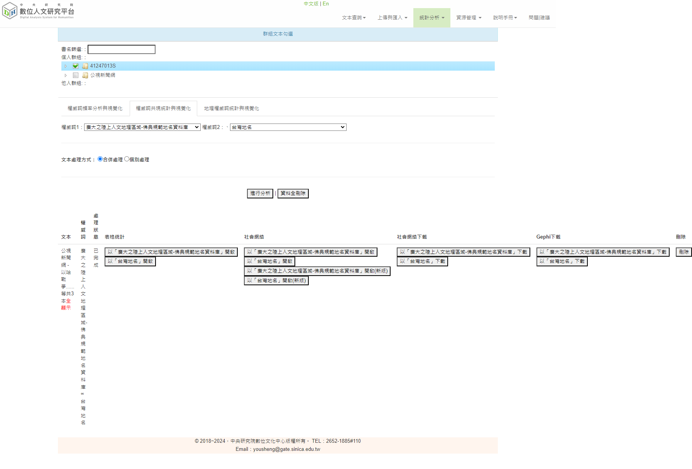
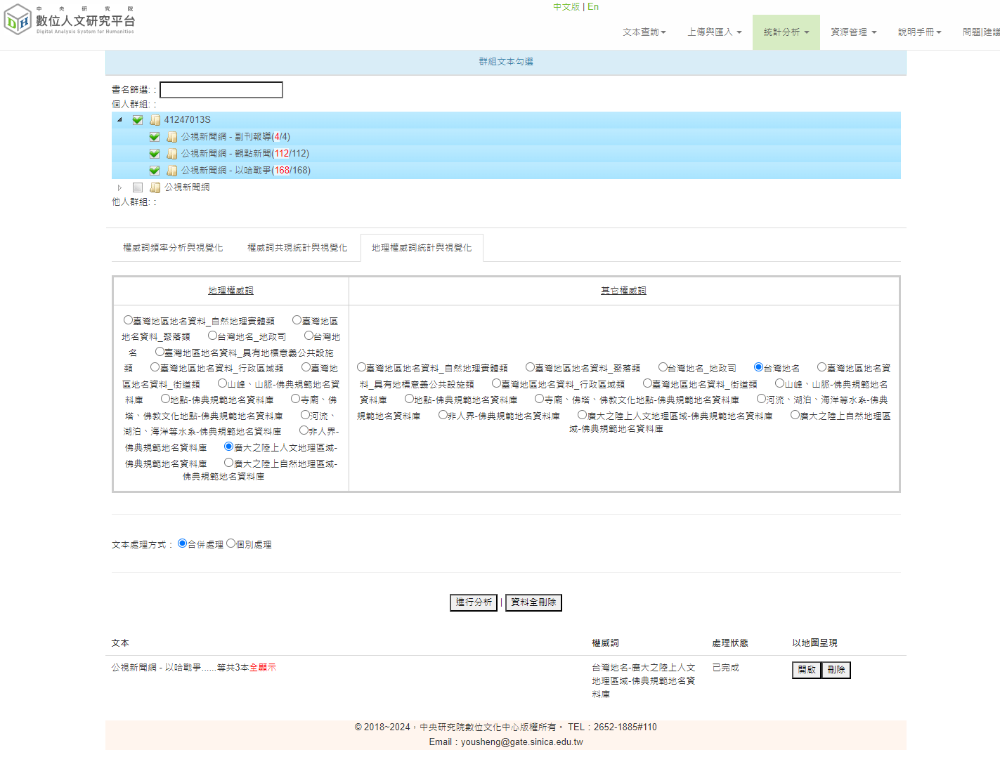

# 中研院數位人文研究平台 使用紀錄與心得
> NTNU 文本分析與程式設計 期末作業 
41247013S 王修佑

## 資料說明
本次所使用的資料集分為「分析文本」與「權威檔文本」。

### 分析文本
- 公視新聞網 - 副刊報導
  - 年份：2023
  - 來源：[https://news.pts.org.tw/supplement](https://news.pts.org.tw/supplement)
- 公視新聞網 - 觀點新聞
  - 年份：2023
  - 來源：[https://news.pts.org.tw/opinion](https://news.pts.org.tw/opinion)
- 公視新聞網 - 以哈戰爭報導
  - 年份：2023
  - 來源：[https://news.pts.org.tw/hotTopic/280](https://news.pts.org.tw/hotTopic/280)

運用 Python requests 與 bs4 爬取成 pandas DataFrame 後，輸出為 xlsx 檔案，上傳人文研究平台匯入群組。

爬蟲程式檔案：[https://github.com/whyhugo/Textual-Data-Analysis/blob/main/final/pts_report_crawler.ipynb](https://github.com/whyhugo/Textual-Data-Analysis/blob/main/final/pts_report_crawler.ipynb)

資料集：[https://github.com/whyhugo/Textual-Data-Analysis/tree/main/final/data](https://github.com/whyhugo/Textual-Data-Analysis/tree/main/final/data)

### 權威檔文本
- 廣大之陸上自然地理區域-佛典規範地名資料庫
  - 來源：平台開放權威檔
- 廣大之陸上人文地理區域-佛典規範地名資料庫
  - 來源：平台開放權威檔
- 地點-佛典規範地名資料庫
  - 來源：平台開放權威檔
- 台灣地名
  - 來源：平台開放權威檔

## 實際操作紀錄
### 權威詞頻率分析與視覺化
1. 加入文本與權威詞 
  
勾選比對文本與權威檔，即可出現此畫面，分析結果分為「百分序」與「百分序」兩種顯示方式。
 

2. 權威詞的百分序 
  
例如，在以哈戰爭報導中「美國」的百分序為 100、「中國」為 70；在觀點報導中「美國」的百分序為 97、「中國」為 99。
 
 
  
以折線圖方式呈現勾選的單詞在各文本中的百分序變化，上圖以「美國」、「中國」、「日本」、「俄羅斯」、「香港」、「法國」與「菲律賓」為例。
 

3. 權威詞的百分比 
將該權威詞頻率，除以最高權威詞的頻率。
  
點擊各個 column bar 上的箭頭即可切換升冪或降冪排序。也可輸入條件進行數值篩選。
 
 
  
以折線圖方式呈現勾選的單詞在各文本中的百分比變化，上圖以「美國」、「伊朗」、「德國」、「韓國」、「香港」、「亞洲」
、「澳洲」與「中華」為例。
 
 
  
  
亦可直接產生圓餅圖（也可特別選擇 Top 25）與文字雲。

### 權威詞共現與視覺化 
1. 加入文本與權威詞 
  
我選擇「廣大之陸上人文地理區域-佛典規範地名資料庫」與「台灣地名」這兩個權威詞檔進行操作。
 

2. 以表格呈現分析結果 
  
以表格方式列出「廣大之陸上人文地理區域-佛典規範地名資料庫」與前十名共現「台灣地名」，此處選擇檢索條件：「美國」AND「和平」，共找到符合段落 27 段，同時可直接檢視原始文本。
 

1. 社會網絡視覺化 
可以透過調整關聯強度、詞頻大小等方式來調整社會網絡的呈現樣貌；
  
  
  
上圖中可以明顯發現，詞頻強度調高後只呈現出現次數較多的權威詞，因此畫面中的單詞數降低、關聯強度調高後節點連線數量明顯減少。
 
 
  
除此之外也可以輸入關鍵字計進行過濾。上圖中以篩選「美國」為例，並且調整關聯強度、詞頻強度、關係距離、縮放大小來呈現社網絡圖。

### 地理權威詞統計與視覺化 
1. 加入文本與地理權威詞 
  
這邊地理權威詞選擇「廣大之陸上人文地理區域-佛典規範地名資料庫」、其它權威詞選擇「台灣地名」。
 

2. 以地圖呈現統計結果 
  
點擊左側的權威詞，地圖上會呈現與該單詞有關的地名。
 
 
  
點擊地名節點與權威詞，即可查看所有符合條件原始文本。上圖為檢索條件：「科羅拉多州」AND「消防局」，共找到符合段落 1 段。
 

3. 套疊歷史地圖 
  
此功能可以在地圖上套疊上古地圖的行政區劃（例如，唐代行政區劃分）來進行統計結果的檢視，不過實際在操作時似乎遇到提供服務端無法連線的狀況，如上圖。
 

4. 自行繪製圖形 
  
透過右上角的工具可進行圖形的繪製，分為 polyline 繪製、面積繪製與圓形繪製。繪製後也可以進行編輯與刪除。
 
 
  
  
點擊圖形區域可以查看區域面積、半徑長度等資訊。
 

5. 面積查詢地名功能 
  
在地圖上繪製面積即可啟用。幾何圖形下需涵蓋我們要統計的地名。
 
 
  
接著點擊左側的列表或是地圖上的圓圈（即該地名在地圖上的範圍），可以看到所有跟此地名有關的權威詞。
 
 
  
點擊畫面中列出的權威詞，即可查看符合檢索條件的原始文本段落，例如上圖中呈現的是「北京」和「亞洲」同時出現的文本，共搜尋到 4 段。
 

### 兩文本差異分析 
1. 進行文本與權威檔配對 
  
先進入「統計分析」中的「管理文本與權威檔配對」，點擊「+」進行文本配對。
 

2. 兩文本差異分析 
進入「統計分析」中的「兩文本差異分析」，選擇要分析的文本（最多 2 個）與權威檔、處理權威詞筆數與頻率差異百分比（這裡以門檻值 10 為例）。
  
表格中「頻率」表示出現的次數、「百分比」則從頻率進行換算，例如，第一名頻率為 88，百分比為 100%，第二名頻率為 56，而 56 為第一名的頻率 88 的 0.636 倍，因此第二名的百分比為 63.6%。
而在比較兩文本之間差異時，當某一單詞百分比的差超過前一步驟設定的門檻值，頻率較高的一邊會顯示紅色，較低的一邊會顯示綠色，若沒有超過門檻值則不會變色。
 

3. N 字詞差異分析 
在兩文本差異分析頁面，分析方式改為選擇「N 字詞」，依序設定 N 字詞區間（此處設定 2~4）、處理權威詞筆數（此處設定 200）與排名差異名次（此處設定 3）。
  
上圖顯示結果中，由左至右依序為二字詞、三字詞與四字詞，並依照出現頻率由高到低排名。若超過設定的門檻值，較高的一邊會顯示紅色、較低的一邊會顯示綠色。圖中可以看到「美國」相差 8 名。
 
 
  
接著可以嘗試將差異比較方式改為「比例差異」（此處以 1 為例）。此比較方式以頻率較低的一邊作為分母來進行計算，若超過設定的門檻值時，較高的一邊顯示紅色、較低的一邊顯示綠色。
 

### 文本的斷詞分析 
進入統計分析中的「管理文本與斷詞功能」。針對文本選擇欲使用的斷詞方式，這邊以 CKIP 進行實作。
 
 
  
接著到首頁點開已經完成斷詞的文本節點，進入斷詞分析，選擇斷詞系統與統計方式，統計界面中可以設定前後的綴詞數（斷詞數）、統計 N 個詞、查詢詞，可向前或向後查詢若干個綴詞，並且可用表格的方式顯示前綴詞在文本中的脈絡，按下「檢視段落」即可查閱原始文本段落，同時可選擇是否顯示斷詞標示。若 N 設定為 2、綴詞數設定為 4，即可查看前 4 個綴詞中 2 個詞連續出現的狀況。同時平台也有提供篩選詞性的功能。

### 推導查詢 
從首頁點選欲分析的文本節點，進入推導查詢。接著設定斷詞系統、統計方式以及是否統計標點符號。下方箭頭代表推導方向，欄位中填入要在幾個詞距離內查詢、查詢幾個連續詞與查詢詞，查詢後即可獲得結果以及文本概況，原始文本查訊時平台會以顏色標記查詢文句，同時可以決定是否顯示所有的詞性。
 
 
  
如上圖，由於<b>系統持續無法完成斷詞超過 4 小時</b>，我無法完成操作這個部份！！！
 

## 心得 
數位人文研究平台整體操作起來，表面上確實不容易上手，在觀看說明影片後逐漸了解平台設計的邏輯後操作起來順暢許多，唯有在 CKIP 斷詞處理等待了非常非常非常非常長的時間（其實根本跑不出來）。在所有功能中我最喜歡權威詞視覺化，這類型的圖表呈現不只在古文、新聞文本分析可以進行 NLP 的詞特徵關聯性比對、甚至近年在一些學術研討會中將議程也進行這樣的分析視覺化，更容易的看要學術與產業關注的議題趨勢。除此之外我認為地理權威詞的功能真的為 NLP 研究與開發者省下許多時間，過往光是資料處理、分箱，再撰寫程式串接地圖視覺化的開源 API 就需要耗費相當大的時間心力，目前平台上將功能完整化，屬實相當實用。本次的操作體驗下來非常新鮮，包括將自己爬取的新聞文本上傳處理後進行間距查詢、推導查詢等，都是過去不曾嘗試的文本分析方式，雖然自己還是比較習慣直接打 code 的方式，不過未來有機會還是想嘗試看看結合平台現有的功能看是否能提升 NLP 模型開發時特徵工程的成效。最後想建議，斷詞除了效能有待加強外，起許日後加入 MONPA 斷詞！